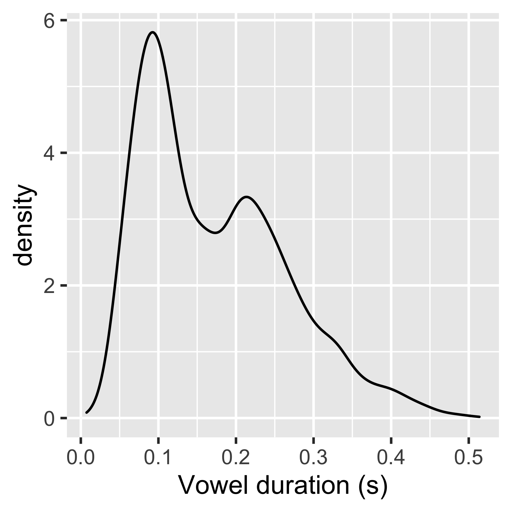
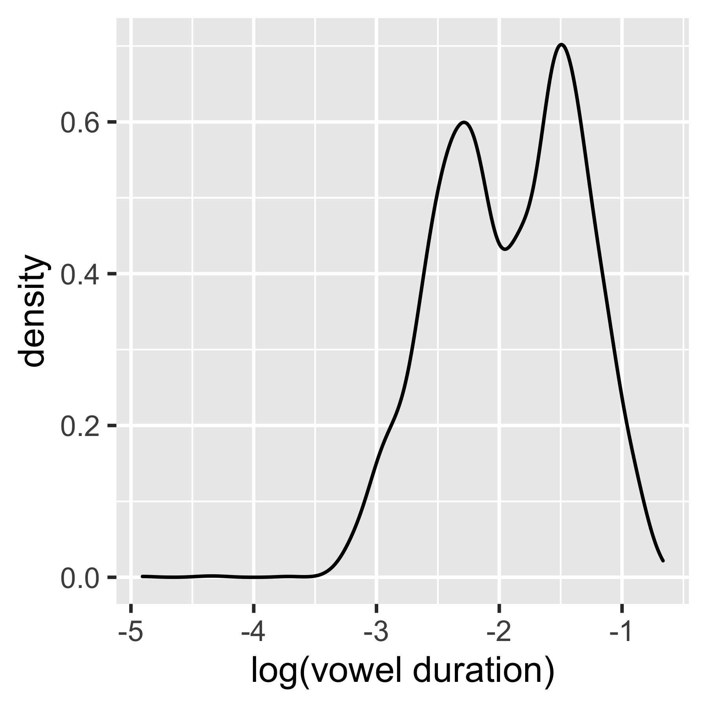
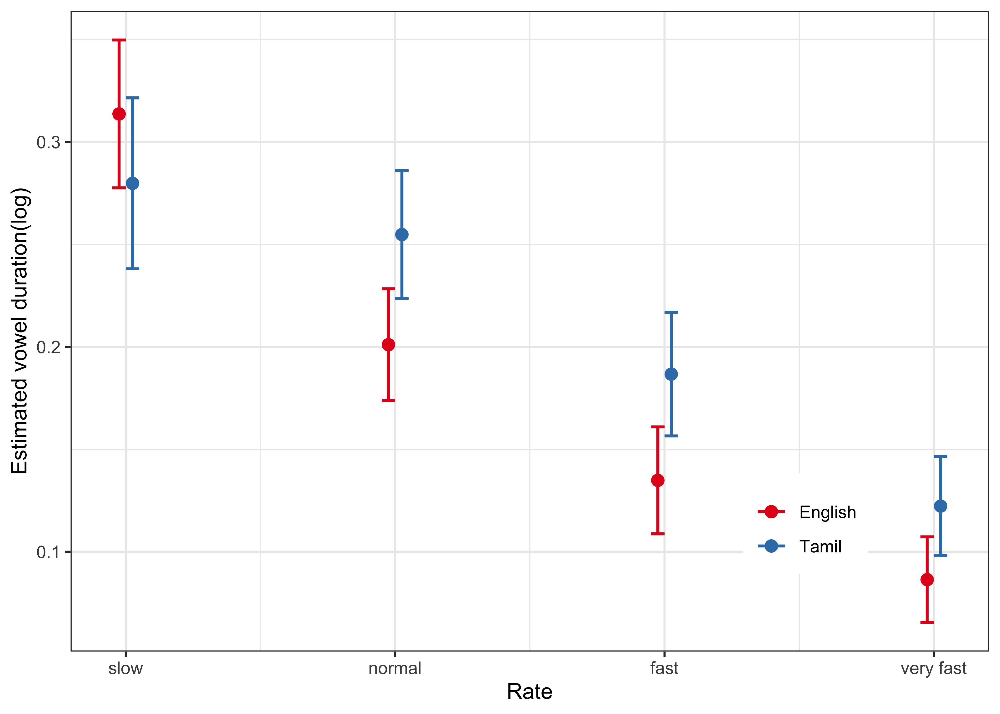
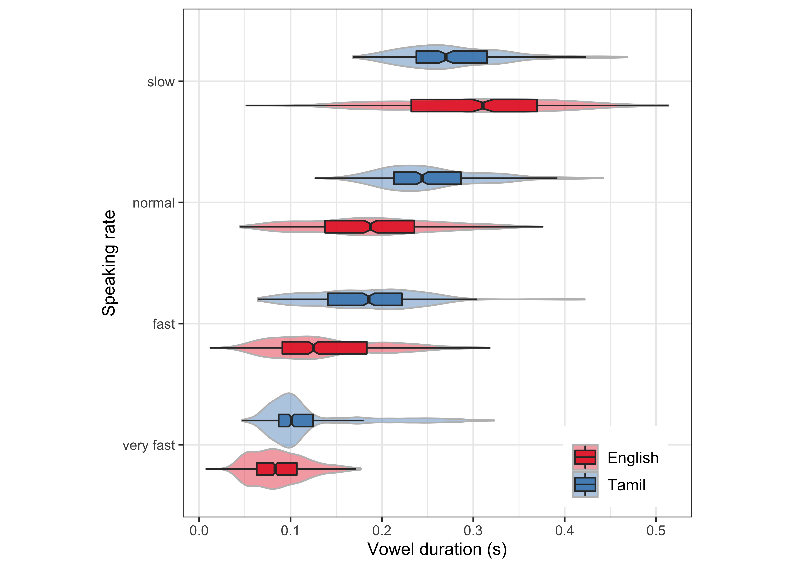
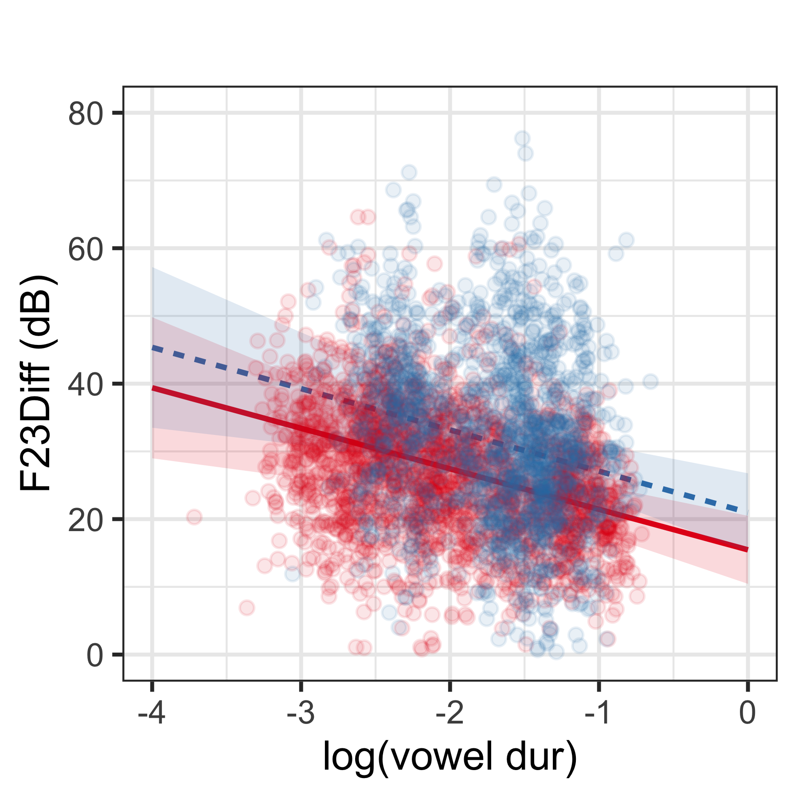
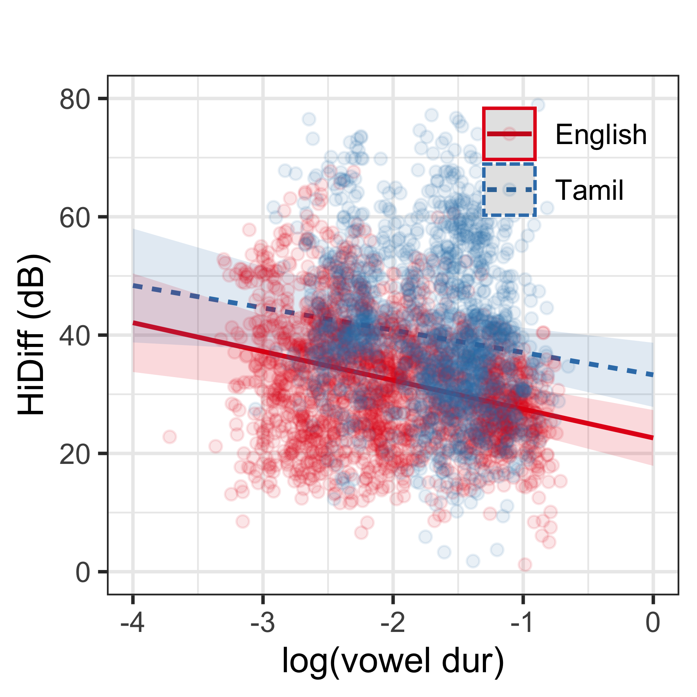
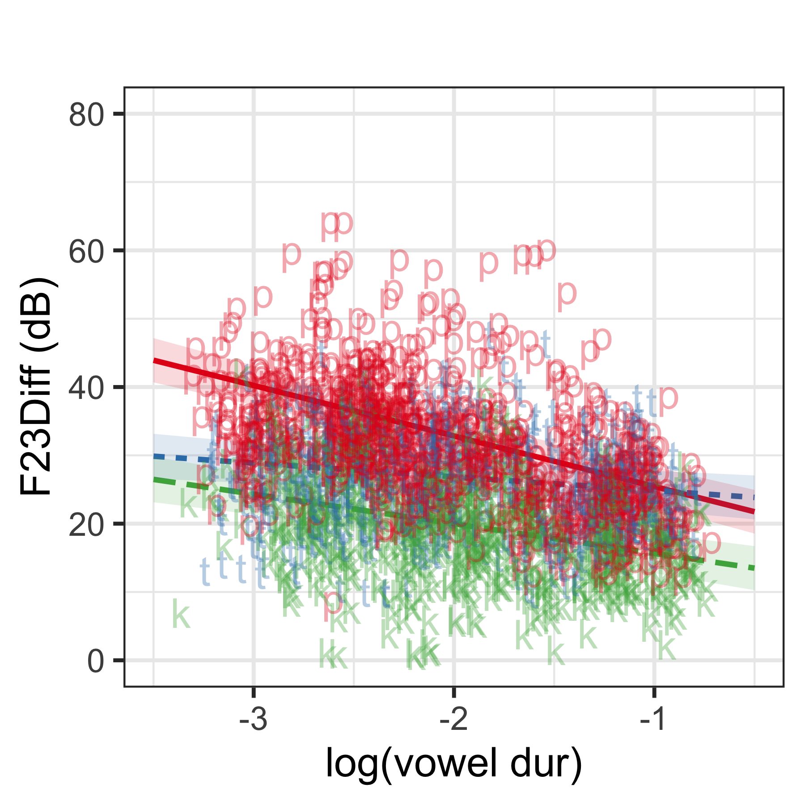
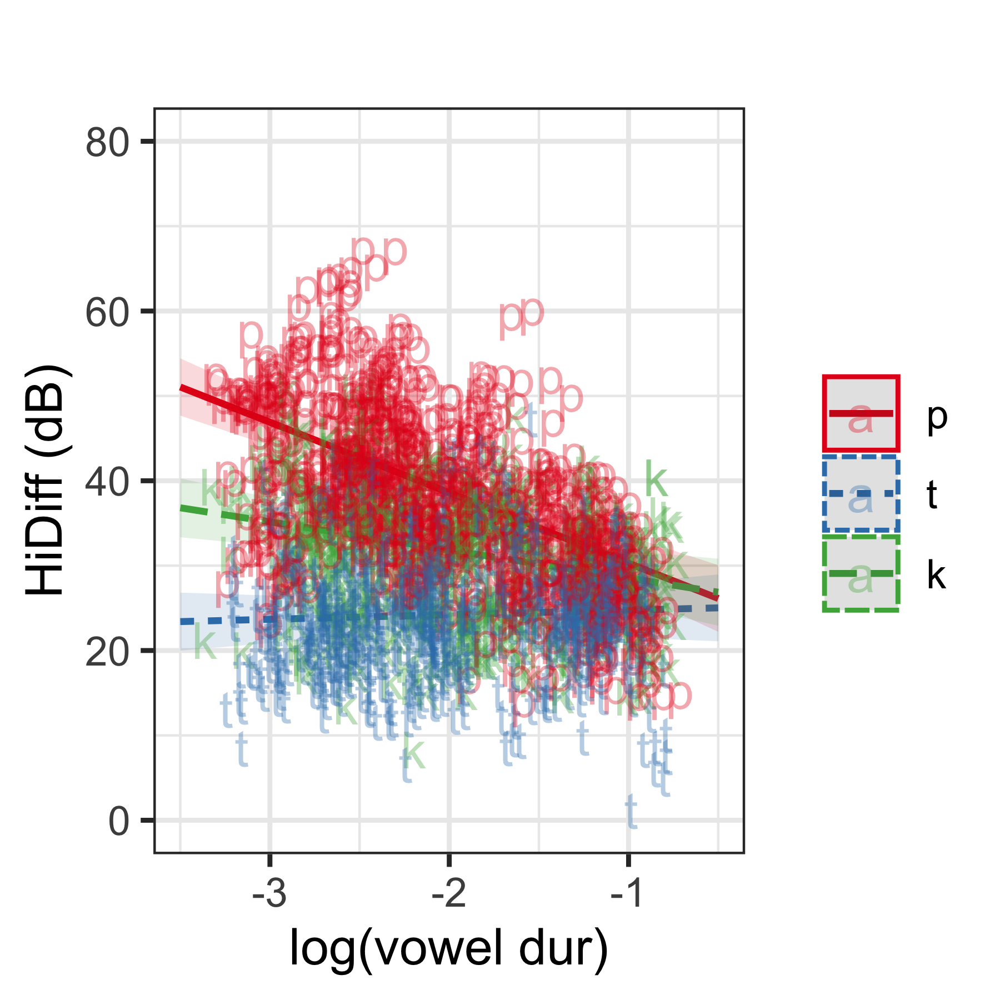
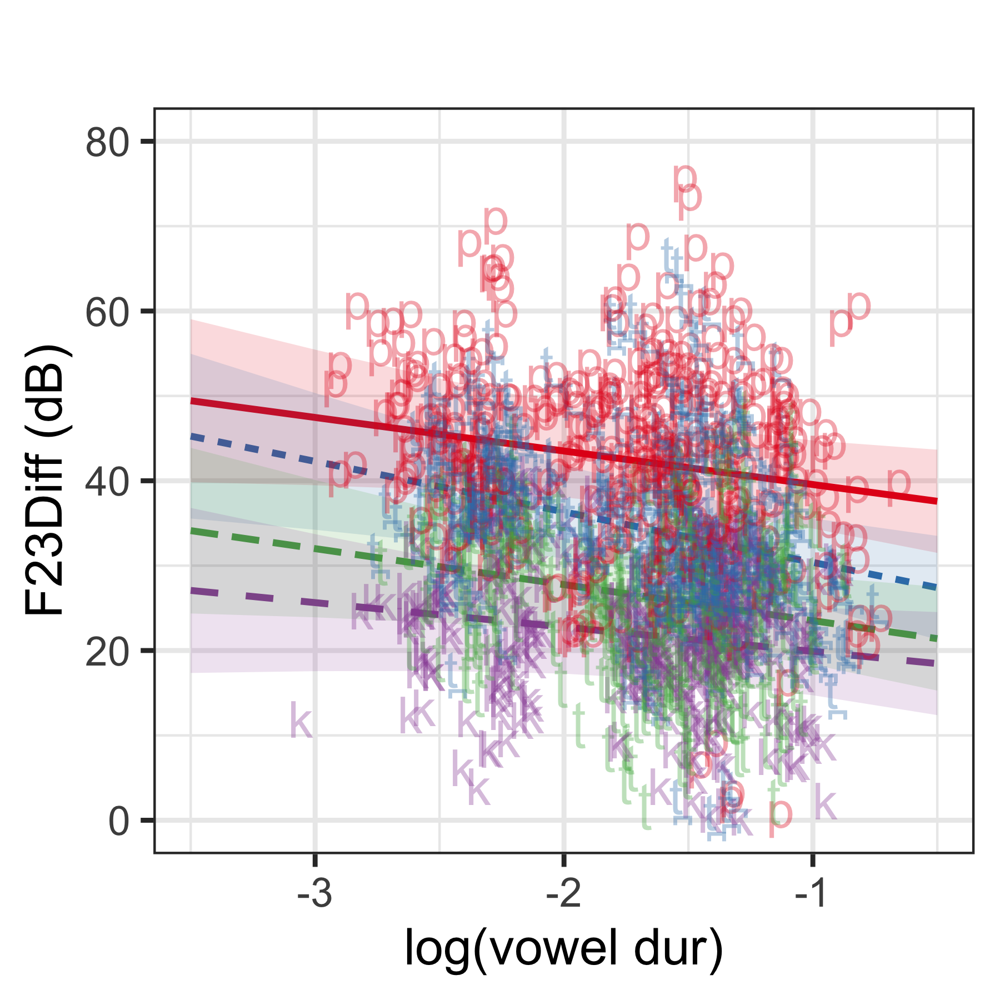
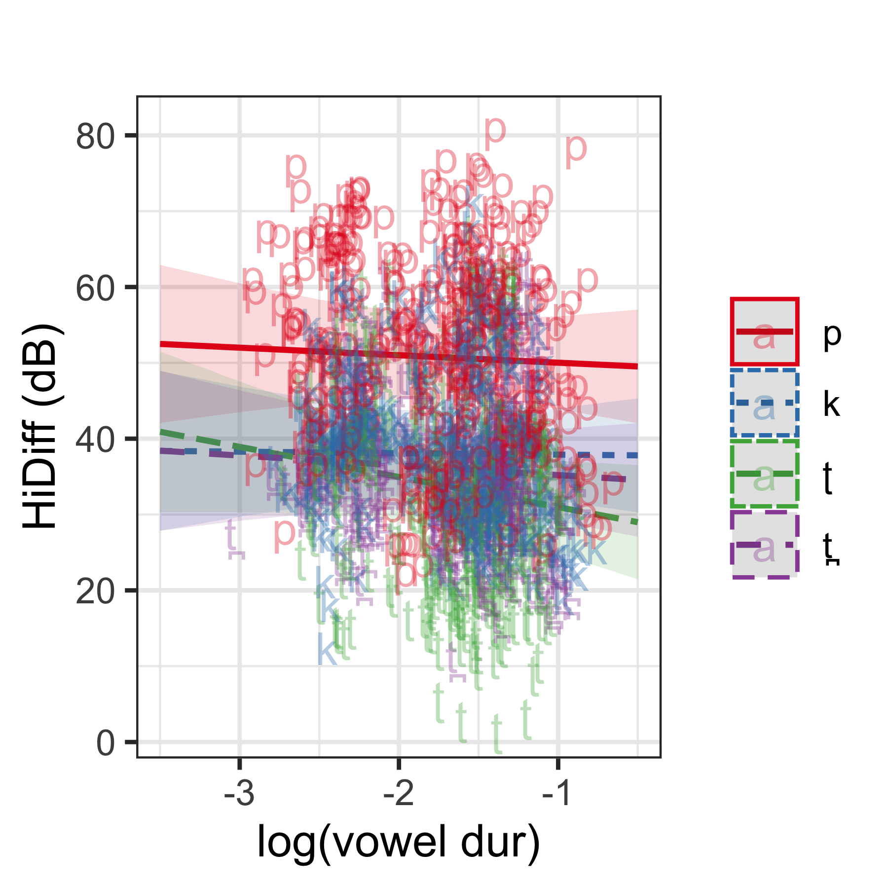

## Background

We're primarily concerned with the relationship between speaking rate and the amplitude (BA) of consonant bursts in onset CVs. We're also interested in whether there are differences in how BA is reflected in languages that differ in how phonological voicing is implemented: English (long-lag VOT) and Indian Tamil (short-lag VOT).

### Methods

Participants (English *n*=12; Tamil *n*=10) self-recorded CVs (at each place of articulation with /a/) at 4 different, self-regulated speeds (slow, normal, fast, very fast).

### Measurements

We looked at a few amplitude landmarks in the burst and following vowel: 

Burst

1. **Ahi**--amplitude of the highest component in the burst spectrum above 3kHz (males), 3.5kHz (females)
2. **Max23**--amplitude of the highest component in the burst spectrum in the range of F2/F3 of the following vowel

Vowel

1. **Av**--average amplitude of F1

Difference measures served as dependent variables:
1. **HiDiff**--Av-Ahi
2. **F23Diff**--Av-Max23

And the temporal measurements:
1. v_dur: Vowel duration of the CV
2. VOT: time from onset of the burst to zero crossing of first periodic wave of the vowel

### Vowel duration
The distribution of v_dur was examined and log-transformed to ensure a more normal distribution --> but do I need it?


The density plots:

<!-- -->
An the log(v_dur) density plot:

<!-- -->

### **Note on speaking rate and vowel duration**
The predictions laid out in the introduction rely on there being a clear relationship between speaking rate and vowel duration. That is, it need not be the case that the more syllables a speaker speaks in a given time affect the duration of the syllabic nucleus. Increases in rate may simply result from a decrease in pauses between syllables. Given this complication we might appeal to the term "articulation rate"(Jacewicz, et al. 2009[LVC]), which captures the rate of speech production not including pauses between syllables. The impressionistic self-assessment of articulation rate as "slow," "normal," "fast," and "very fast," leads to a highly variable productions between speakers. In order to avoid bleaching the variation in articulation rate production (which inevitably occurs in designs that aggregate tokens according to impressionistic rate) a continuous measure such as vowel duration (in CVs) is desirable. While it need not be the case that vowels in CVs decrease in duration with increased rate, it remains an empirical question in the present data whether such a relationship is borne out. 

Vowel duration data, which was log transformed to reflect a normal distribution, was modeled as a function of Rate and Language.
Getting data and fixing some factors:


The model:

```
## Linear mixed-effects model fit by REML
##   Data: rate 
##         AIC       BIC   logLik
##   -14009.39 -13890.88 7023.697
## 
## Random effects:
##  Formula: ~1 + rate | sub
##  Structure: General positive-definite, Log-Cholesky parametrization
##               StdDev     Corr                
## (Intercept)   0.06343665 (Intr) rtnrml ratfst
## ratenormal    0.04699030 -0.670              
## ratefast      0.06875148 -0.762  0.823       
## ratevery fast 0.06861315 -0.850  0.624  0.867
## Residual      0.03612480                     
## 
## Fixed effects:  v_dur ~ rate * lang 
##                               Value  Std.Error   DF    t-value p-value
## (Intercept)              0.31368955 0.01841450 3762  17.034922  0.0000
## ratenormal              -0.11262895 0.01396285 3762  -8.066329  0.0000
## ratefast                -0.17885315 0.01999434 3762  -8.945191  0.0000
## ratevery fast           -0.22730680 0.01995739 3762 -11.389606  0.0000
## langTamil               -0.03388071 0.02814385   19  -1.203841  0.2434
## ratenormal:langTamil     0.08765063 0.02121950 3762   4.130665  0.0000
## ratefast:langTamil       0.08573001 0.03056328 3762   2.805000  0.0051
## ratevery fast:langTamil  0.06977217 0.03050288 3762   2.287396  0.0222
##  Correlation: 
##                         (Intr) rtnrml ratfst rtvryf lngTml rtnr:T rtfs:T
## ratenormal              -0.662                                          
## ratefast                -0.763  0.807                                   
## ratevery fast           -0.849  0.615  0.863                            
## langTamil               -0.654  0.433  0.499  0.555                     
## ratenormal:langTamil     0.435 -0.658 -0.531 -0.405 -0.666              
## ratefast:langTamil       0.499 -0.528 -0.654 -0.565 -0.763  0.812       
## ratevery fast:langTamil  0.555 -0.403 -0.565 -0.654 -0.849  0.619  0.863
## 
## Standardized Within-Group Residuals:
##         Min          Q1         Med          Q3         Max 
## -9.50656601 -0.52674499 -0.05010961  0.48470575  5.81683675 
## 
## Number of Observations: 3789
## Number of Groups: 21
```

```
## NOTE: Results may be misleading due to involvement in interactions
```

```
##  contrast           estimate      SE   df t.ratio p.value
##  slow - normal        0.0688 0.01061 3762   6.485  <.0001
##  slow - fast          0.1360 0.01528 3762   8.899  <.0001
##  slow - very fast     0.1924 0.01525 3762  12.617  <.0001
##  normal - fast        0.0672 0.00910 3762   7.386  <.0001
##  normal - very fast   0.1236 0.01203 3762  10.275  <.0001
##  fast - very fast     0.0564 0.00798 3762   7.068  <.0001
## 
## Results are averaged over the levels of: lang 
## Degrees-of-freedom method: containment 
## P value adjustment: tukey method for comparing a family of 4 estimates
```

```
##  contrast           effect.size    SE df lower.CL upper.CL
##  slow - normal             1.90 0.294 19     1.29     2.52
##  slow - fast               3.76 0.423 19     2.88     4.65
##  slow - very fast          5.33 0.422 19     4.44     6.21
##  normal - fast             1.86 0.252 19     1.33     2.39
##  normal - very fast        3.42 0.333 19     2.72     4.12
##  fast - very fast          1.56 0.221 19     1.10     2.02
## 
## Results are averaged over the levels of: lang 
## sigma used for effect sizes: 0.03612 
## Degrees-of-freedom method: inherited from containment when re-gridding 
## Confidence level used: 0.95
```
The plot:
<!-- -->

Here is the real data:

```
## ── Attaching packages ─────────────────────────────────────── tidyverse 1.3.1 ──
```

```
## ✓ tibble  3.1.6     ✓ dplyr   1.0.7
## ✓ tidyr   1.1.4     ✓ stringr 1.4.0
## ✓ readr   1.4.0     ✓ forcats 0.5.1
## ✓ purrr   0.3.4
```

```
## ── Conflicts ────────────────────────────────────────── tidyverse_conflicts() ──
## x dplyr::collapse() masks nlme::collapse()
## x dplyr::filter()   masks stats::filter()
## x dplyr::lag()      masks stats::lag()
```

```
## 
## The downloaded binary packages are in
## 	/var/folders/nv/72l7lgjs2s5d2y6bbl5wz6w40000gn/T//RtmpFqHLox/downloaded_packages
```

```
## Warning: Ignoring unknown parameters: notch, outlier.shape
```

<!-- -->

### Make a full data frame for Burst models

The data were coded separately by language. We want to make a full model, so need to combine the dataframes.First clean up the Tamil data: 


Now do something similar for English:


Make a new full data frame:


## Models and Plots
First we need to install "sjPlot" which will give linear model prediction plots with confidence intervals


Make a "lang" column in the **full** data frame. Make new column (log_vdur) because we're taking log of duration measures (as suggested by a reviewer).


### **Models and Plots of F23Diff and HiDiff (with both languages)**
## F23Diff

```
## Linear mixed-effects model fit by REML
##   Data: full 
##        AIC     BIC    logLik
##   25671.91 25721.2 -12827.95
## 
## Random effects:
##  Formula: ~1 + logv_dur | sub
##  Structure: General positive-definite, Log-Cholesky parametrization
##             StdDev   Corr  
## (Intercept) 8.420798 (Intr)
## logv_dur    5.712429 0.689 
## Residual    9.195737       
## 
## Fixed effects:  F23Diff ~ logv_dur * lang 
##                        Value Std.Error   DF   t-value p-value
## (Intercept)        15.463022  2.563361 3484  6.032323  0.0000
## logv_dur           -5.983280  1.702555 3484 -3.514295  0.0004
## langTamil           5.518438  3.909974   20  1.411375  0.1735
## logv_dur:langTamil -0.110112  2.606735 3484 -0.042241  0.9663
##  Correlation: 
##                    (Intr) lgv_dr lngTml
## logv_dur            0.708              
## langTamil          -0.656 -0.464       
## logv_dur:langTamil -0.462 -0.653  0.725
## 
## Standardized Within-Group Residuals:
##         Min          Q1         Med          Q3         Max 
## -3.13179308 -0.67893680  0.01514047  0.60285624  4.43025576 
## 
## Number of Observations: 3508
## Number of Groups: 22
```
And the F23Diff plot for the full data set:

```
## Scale for 'y' is already present. Adding another scale for 'y', which will
## replace the existing scale.
## Scale for 'y' is already present. Adding another scale for 'y', which will
## replace the existing scale.
```

```
## Warning: Removed 2 row(s) containing missing values (geom_path).
```

```
## Warning: Removed 1 rows containing missing values (geom_point).
```

<!-- -->

The plot confirms the model results: There is no significant language effect, though Tamil is overall 4.5dB higher (more amplitude difference between BA and V; quieter) in the F2/F3 range than English. The effect of logv_dur is evident (negative, decreasing by 6dB per unit of logv_dur). There is no interaction.

## HiDiff

```
## Linear mixed-effects model fit by REML
##   Data: full 
##        AIC      BIC    logLik
##   25974.42 26023.71 -12979.21
## 
## Random effects:
##  Formula: ~1 + logv_dur | sub
##  Structure: General positive-definite, Log-Cholesky parametrization
##             StdDev   Corr  
## (Intercept) 7.803985 (Intr)
## logv_dur    4.236696 0.54  
## Residual    9.616089       
## 
## Fixed effects:  HiDiff ~ logv_dur * lang 
##                        Value Std.Error   DF   t-value p-value
## (Intercept)        22.614814  2.407110 3484  9.395008  0.0000
## logv_dur           -4.870581  1.299811 3484 -3.747146  0.0002
## langTamil          10.666652  3.668565   20  2.907581  0.0087
## logv_dur:langTamil  1.095494  2.019957 3484  0.542335  0.5876
##  Correlation: 
##                    (Intr) lgv_dr lngTml
## logv_dur            0.589              
## langTamil          -0.656 -0.386       
## logv_dur:langTamil -0.379 -0.643  0.617
## 
## Standardized Within-Group Residuals:
##        Min         Q1        Med         Q3        Max 
## -3.4201684 -0.6773617 -0.0484311  0.6153636  4.3434950 
## 
## Number of Observations: 3508
## Number of Groups: 22
```

```
## Scale for 'y' is already present. Adding another scale for 'y', which will
## replace the existing scale.
## Scale for 'y' is already present. Adding another scale for 'y', which will
## replace the existing scale.
```

```
## Warning: Removed 2 row(s) containing missing values (geom_path).
```

```
## Warning: Removed 2 rows containing missing values (geom_point).
```

<!-- -->

The plot confirms that HiDiff is higher (lower BA) in Tamil (11.69dB) than English. The effect of logv_dur on HiDiff is the same in both languages (-4.83dB/unit logv_dur).

Now let's make a new FULL data frame with just p-s and k-s (both are in English and Tamil) [Not executed here]
```
full_pk <- full[which(full$POA=="1" | full$POA=="3"),]
```
We're going to model the difference between p and k as a function of vowel duration in the two languages
```
pk_model <- lme(HiDiff ~ POA * logv_dur * lang, full_pk, random = ~1 + logv_dur | sub)
summary(pk_model)
plot_model(pk_model, type="pred", terms = c("logv_dur","POA", "lang"))
```

## Language-specific models

Next we model F23Diff and HiDiff in each language to examine the effects of place of articulation (POA) as well as speaking rate (logv_dur).

## **English**

### F23Diff Model

```
## Linear mixed-effects model fit by REML
##   Data: eng 
##        AIC      BIC    logLik
##   13267.36 13323.59 -6623.681
## 
## Random effects:
##  Formula: ~1 + logv_dur | sub
##  Structure: General positive-definite, Log-Cholesky parametrization
##             StdDev   Corr  
## (Intercept) 5.721220 (Intr)
## logv_dur    1.752705 0.604 
## Residual    6.027890       
## 
## Fixed effects:  F23Diff ~ POA * logv_dur 
##                   Value Std.Error   DF    t-value p-value
## (Intercept)   18.049802 1.8327098 2033   9.848696       0
## POAt           4.789144 1.0692112 2033   4.479138       0
## POAk          -6.721391 1.0967030 2033  -6.128725       0
## logv_dur      -7.392485 0.6350577 2033 -11.640650       0
## POAt:logv_dur  5.383440 0.5023528 2033  10.716453       0
## POAk:logv_dur  3.063838 0.5292525 2033   5.788990       0
##  Correlation: 
##               (Intr) POAt   POAk   lgv_dr POAt:_
## POAt          -0.278                            
## POAk          -0.275  0.475                     
## logv_dur       0.684 -0.359 -0.357              
## POAt:logv_dur -0.260  0.953  0.449 -0.367       
## POAk:logv_dur -0.251  0.437  0.953 -0.355  0.453
## 
## Standardized Within-Group Residuals:
##          Min           Q1          Med           Q3          Max 
## -4.189331196 -0.660845533 -0.008732887  0.647414422  4.188868778 
## 
## Number of Observations: 2050
## Number of Groups: 12
```

### F23Diff Plot

```
## Scale for 'y' is already present. Adding another scale for 'y', which will
## replace the existing scale.
```

```
## Warning: Removed 6 row(s) containing missing values (geom_path).
```

```
## Warning: Removed 2 rows containing missing values (geom_text).
```

<!-- -->

### HiDiff Model

```
## Linear mixed-effects model fit by REML
##   Data: eng 
##       AIC      BIC    logLik
##   13339.8 13396.02 -6659.898
## 
## Random effects:
##  Formula: ~1 + logv_dur | sub
##  Structure: General positive-definite, Log-Cholesky parametrization
##             StdDev   Corr  
## (Intercept) 7.837531 (Intr)
## logv_dur    3.006828 0.859 
## Residual    6.125587       
## 
## Fixed effects:  HiDiff ~ POA * logv_dur 
##                   Value Std.Error   DF   t-value p-value
## (Intercept)   21.977997 2.4035900 2033  9.143821  0.0000
## POAt           3.319602 1.0876172 2033  3.052178  0.0023
## POAk           3.234407 1.1158782 2033  2.898531  0.0038
## logv_dur      -8.306631 0.9528595 2033 -8.717581  0.0000
## POAt:logv_dur  8.846597 0.5108015 2033 17.319049  0.0000
## POAk:logv_dur  4.990986 0.5384835 2033  9.268595  0.0000
##  Correlation: 
##               (Intr) POAt   POAk   lgv_dr POAt:_
## POAt          -0.216                            
## POAk          -0.214  0.475                     
## logv_dur       0.870 -0.244 -0.243              
## POAt:logv_dur -0.202  0.953  0.449 -0.249       
## POAk:logv_dur -0.195  0.437  0.953 -0.242  0.453
## 
## Standardized Within-Group Residuals:
##          Min           Q1          Med           Q3          Max 
## -3.625054357 -0.645872405  0.001457556  0.606850629  3.705172369 
## 
## Number of Observations: 2050
## Number of Groups: 12
```

### HiDiff Plot

```
## Scale for 'y' is already present. Adding another scale for 'y', which will
## replace the existing scale.
```

```
## Warning: Removed 6 row(s) containing missing values (geom_path).
```

```
## Warning: Removed 2 rows containing missing values (geom_text).
```

<!-- -->

## **Tamil**

### F23Diff Model (Tamil)

```
## Linear mixed-effects model fit by REML
##   Data: tam 
##        AIC      BIC    logLik
##   10018.72 10082.07 -4997.358
## 
## Random effects:
##  Formula: ~1 + logv_dur | sub
##  Structure: General positive-definite, Log-Cholesky parametrization
##             StdDev    Corr  
## (Intercept) 10.781643 (Intr)
## logv_dur     5.602153 0.69  
## Residual     7.314837       
## 
## Fixed effects:  F23Diff ~ POA * logv_dur 
##                   Value Std.Error   DF   t-value p-value
## (Intercept)    35.60760  3.775104 1441  9.432218  0.0000
## POAt̪          -11.17536  2.015946 1441 -5.543482  0.0000
## POAʈ          -16.33032  2.091883 1441 -7.806517  0.0000
## POAk          -18.58287  2.032474 1441 -9.142981  0.0000
## logv_dur       -3.95131  2.003884 1441 -1.971826  0.0488
## POAt̪:logv_dur  -1.99926  1.118121 1441 -1.788054  0.0740
## POAʈ:logv_dur  -0.29085  1.179988 1441 -0.246485  0.8053
## POAk:logv_dur   1.07846  1.137651 1441  0.947970  0.3433
##  Correlation:
```

```
## Warning in abbreviate(colnames(x), minlength = rdig + 3): abbreviate used with
## non-ASCII chars
```

```
##               (Intr) POAt̪   POAʈ   POAk   lgv_dr POA̪:_  POAʈ:_
## POAt̪          -0.254                                          
## POAʈ          -0.255  0.465                                   
## POAk          -0.266  0.483  0.472                            
## logv_dur       0.744 -0.251 -0.252 -0.265                     
## POAt̪:logv_dur -0.238  0.963  0.439  0.455 -0.254              
## POAʈ:logv_dur -0.238  0.432  0.965  0.437 -0.255  0.442       
## POAk:logv_dur -0.245  0.452  0.442  0.962 -0.262  0.463  0.444
## 
## Standardized Within-Group Residuals:
##         Min          Q1         Med          Q3         Max 
## -3.34805541 -0.61373420 -0.03676703  0.59083622  4.18121390 
## 
## Number of Observations: 1458
## Number of Groups: 10
```

### F23Diff Plot (Tamil)

```
## Scale for 'y' is already present. Adding another scale for 'y', which will
## replace the existing scale.
```

<!-- -->

#### Pairwise comparisons between POAs (Tamil F23Diff)
First make a model that doesn't have logv_dur as an interaction factor but as an additive factor.


```
##  contrast  estimate    SE   df t.ratio p.value
##   p - t̪        7.74 0.547 1444  14.152  <.0001
##   p - ʈ       15.82 0.551 1444  28.708  <.0001
##   p - k       20.38 0.557 1444  36.585  <.0001
##   t̪ - ʈ        8.09 0.545 1444  14.835  <.0001
##   t̪ - k       12.64 0.548 1444  23.045  <.0001
##   ʈ - k        4.55 0.548 1444   8.307  <.0001
## 
## Degrees-of-freedom method: containment 
## P value adjustment: tukey method for comparing a family of 4 estimates
```

```
##  contrast  effect.size     SE df lower.CL upper.CL
##   p - t̪          1.056 0.0746  9    0.887    1.225
##   p - ʈ          2.160 0.0752  9    1.990    2.330
##   p - k          2.782 0.0760  9    2.610    2.954
##   t̪ - ʈ          1.104 0.0744  9    0.936    1.272
##   t̪ - k          1.725 0.0749  9    1.556    1.895
##   ʈ - k          0.621 0.0748  9    0.452    0.791
## 
## sigma used for effect sizes: 7.325 
## Degrees-of-freedom method: inherited from containment when re-gridding 
## Confidence level used: 0.95
```

### HiDiff Model

```
## Linear mixed-effects model fit by REML
##   Data: tam 
##        AIC      BIC    logLik
##   10374.18 10437.54 -5175.092
## 
## Random effects:
##  Formula: ~1 + logv_dur | sub
##  Structure: General positive-definite, Log-Cholesky parametrization
##             StdDev    Corr  
## (Intercept) 13.801240 (Intr)
## logv_dur     6.800062 0.784 
## Residual     8.267072       
## 
## Fixed effects:  HiDiff ~ POA * logv_dur 
##                   Value Std.Error   DF   t-value p-value
## (Intercept)    49.02991  4.737483 1441 10.349359  0.0000
## POAk          -11.32368  2.278459 1441 -4.969888  0.0000
## POAʈ          -22.02979  2.364418 1441 -9.317212  0.0000
## POAt̪          -15.11697  2.297717 1441 -6.579125  0.0000
## logv_dur       -0.98952  2.400413 1441 -0.412229  0.6802
## POAk:logv_dur   0.79510  1.263700 1441  0.629186  0.5293
## POAʈ:logv_dur  -2.98440  1.333731 1441 -2.237634  0.0254
## POAt̪:logv_dur  -0.29805  1.285957 1441 -0.231774  0.8167
##  Correlation:
```

```
## Warning in abbreviate(colnames(x), minlength = rdig + 3): abbreviate used with
## non-ASCII chars
```

```
##               (Intr) POAk   POAʈ   POAt̪   lgv_dr POAk:_ POAʈ:_
## POAk          -0.229                                          
## POAʈ          -0.230  0.465                                   
## POAt̪          -0.240  0.483  0.471                            
## logv_dur       0.814 -0.237 -0.238 -0.250                     
## POAk:logv_dur -0.214  0.963  0.439  0.455 -0.240              
## POAʈ:logv_dur -0.215  0.432  0.965  0.437 -0.241  0.442       
## POAt̪:logv_dur -0.221  0.452  0.442  0.962 -0.248  0.463  0.444
## 
## Standardized Within-Group Residuals:
##         Min          Q1         Med          Q3         Max 
## -3.58958600 -0.65006391 -0.06205775  0.64230112  3.78102861 
## 
## Number of Observations: 1458
## Number of Groups: 10
```

### HiDiff Plot
<!-- -->

#### Pairwise comparisons between POAs (Tamil HiDiff)
First make a model that doesn't have logv_dur as an interaction factor but as an additive factor.

```
## Linear mixed-effects model fit by REML
##   Data: tam 
##        AIC      BIC    logLik
##   10383.01 10430.54 -5182.504
## 
## Random effects:
##  Formula: ~1 + logv_dur | sub
##  Structure: General positive-definite, Log-Cholesky parametrization
##             StdDev    Corr  
## (Intercept) 13.677256 (Intr)
## logv_dur     6.671304 0.781 
## Residual     8.283415       
## 
## Fixed effects:  HiDiff ~ POA + logv_dur 
##                 Value Std.Error   DF    t-value p-value
## (Intercept)  47.97902  4.520417 1444  10.613848  0.0000
## POAk        -12.65826  0.618307 1444 -20.472469  0.0000
## POAʈ        -16.99306  0.623348 1444 -27.260979  0.0000
## POAt̪        -14.57239  0.630006 1444 -23.130556  0.0000
## logv_dur     -1.59537  2.246891 1444  -0.710034  0.4778
##  Correlation: 
##          (Intr) POAk   POAʈ   POAt̪  
## POAk     -0.082                     
## POAʈ     -0.081  0.507              
## POAt̪     -0.098  0.506  0.511       
## logv_dur  0.795 -0.016 -0.009 -0.036
## 
## Standardized Within-Group Residuals:
##         Min          Q1         Med          Q3         Max 
## -3.57433144 -0.64924701 -0.06583899  0.63756926  3.82317152 
## 
## Number of Observations: 1458
## Number of Groups: 10
```
Then the pairwise comparisons:

```
##  contrast estimate    SE   df t.ratio p.value
##  p - k       12.66 0.618 1444  20.472  <.0001
##  p - ʈ       16.99 0.623 1444  27.261  <.0001
##  p - t̪       14.57 0.630 1444  23.131  <.0001
##  k - ʈ        4.33 0.616 1444   7.032  <.0001
##  k - t̪        1.91 0.620 1444   3.086  0.0111
##  ʈ - t̪       -2.42 0.620 1444  -3.906  0.0006
## 
## Degrees-of-freedom method: containment 
## P value adjustment: tukey method for comparing a family of 4 estimates
```

```
##  contrast effect.size     SE df lower.CL upper.CL
##  p - k          1.528 0.0746  9   1.3593    1.697
##  p - ʈ          2.051 0.0753  9   1.8812    2.222
##  p - t̪          1.759 0.0761  9   1.5872    1.931
##  k - ʈ          0.523 0.0744  9   0.3550    0.692
##  k - t̪          0.231 0.0749  9   0.0617    0.400
##  ʈ - t̪         -0.292 0.0748  9  -0.4615   -0.123
## 
## sigma used for effect sizes: 8.283 
## Degrees-of-freedom method: inherited from containment when re-gridding 
## Confidence level used: 0.95
```
